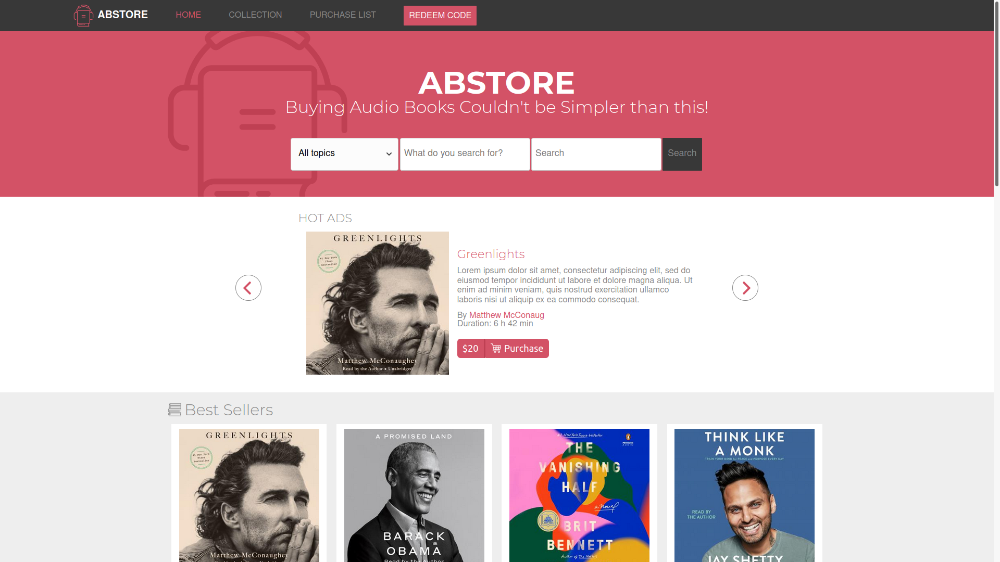

# HTML and CSS Capstone Project

> This project is about building a website following [this design](https://www.behance.net/gallery/24796463/ZATTIX) but choosing a thematic and using customized content. The thematic chosen was an audio book store, for that, the content of this [website](https://www.audiobooks.com) was used.

**Here you can see a [video](https://www.loom.com/share/e138112e182d496b850785ce4523dacc) with an explanation a little more detailed about this project.**

## Built With

- HTML
- CSS

## Live Demo

You can see the [live demo here](https://kuawi.github.io/mv-store-responsive-frontend/)

## Authors

👤 **Author**

- GitHub: [@kuawi](https://github.com/kuawi)
- Twitter: [@jllozano_mx](https://twitter.com/jllozano_mx)
- LinkedIn: [Jose L. Lozano](https://www.linkedin.com/in/jose-luis-lozano-9a94191bb/)

## Show your support

Give a ⭐️ if you like this project!

## Acknowledgments

- This website was made following [the design](https://www.behance.net/gallery/24796463/ZATTIX) of [Mohammed Awad](https://www.behance.net/M_Awad)
- The thumbnail images for the audiobooks belong to [audiobooks.com](https://www.audiobooks.com/)

## 📝 License

This project is [MIT](https://github.com/kuawi/HTML-CSS-Capstone-Project/blob/developing/LICENSE) licensed.
